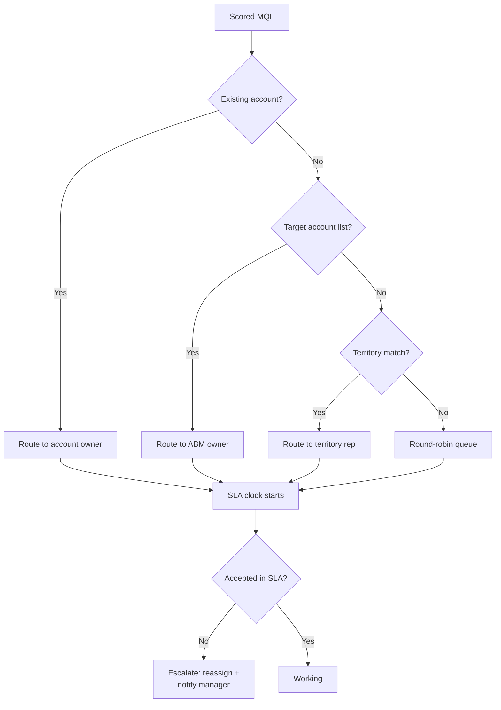

# 03 - Routing and Assignment

Routing decides who works the lead. Done well it is invisible; done badly it is the top reason good leads die.

## Routing models

| Model | How it works | Best for |
|-------|-------------|----------|
| Round-robin | Even distribution across a queue | High-velocity inbound, SDR teams |
| Territory | Geography / segment / named accounts | Enterprise, account-based motions |
| Account-based | Lead routes to the account owner | ABM, land-and-expand motions |
| Skill / language | Matched on attributes | Multi-region, technical products |
| Hybrid | Territory for target accounts, round-robin for the rest | Most mid-market+ companies |

## The routing flow

## Speed-to-lead SLA

The data is unambiguous: contact rates collapse after the first few minutes. Design for it:

- **Under 5 minutes** for demo requests and hand-raisers. Automated alert (Slack, task, dialer) the moment routing completes.
- **Under 1 hour** for standard MQLs during business hours.
- **Next business day** for off-hours; do not pretend otherwise in reporting.

Measure acceptance time (routed → first human touch), not just assignment time. Assignment without action is theater.

## Fallbacks and exception handling

Every routing rule needs an else branch:

- No territory match → round-robin or a dedicated overflow queue, never unassigned.
- Rep on PTO → backup assignment or queue redistribution.
- Rejected leads → back to nurture with a reason code, not a black hole.
- Stale queue → aging report; anything untouched past SLA escalates automatically.

In Salesforce terms: assignment rules or Flow-based routing, queues per motion, and escalation rules with time triggers. Keep the logic in one place (Flow), not scattered across assignment rules, triggers, and process builders.

## Common failure modes

- **Routing on unenriched data** (fixed in [01 - Capture and Enrichment](01-capture-and-enrichment.md)).
- **Too many queues.** If SDRs check five queues, they work one. Consolidate.
- **No rebalancing.** Round-robin drifts as headcount changes; audit distribution monthly.
- **Territory changes mid-quarter** without rerouting open leads. Freeze or migrate deliberately.
